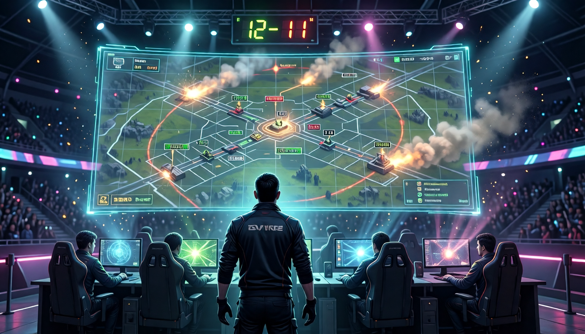

# ESports Simulator



A Valorant-flavored esports management sim in the spirit of *Esports Manager
2026*: run an org, build a roster, train players, work the transfer market,
scout rivals, talk to your players, and win Champions — with every match
decided by a deterministic tick-level simulation on real, walkable maps, not
a dice roll.

See **[GDD.md](GDD.md)** for the full game design document (systems,
mechanics, content, and where this is going) and **[ROADMAP.md](ROADMAP.md)**
for sprint-by-sprint status.

## Play

```bash
# Windows: use your venv's python (requires Python 3.12+)
python -m venv .venv-win
.venv-win\Scripts\python -m pip install -e ".[dev,web]"

# Browser (recommended) — campaign hub + isometric match viewer
.venv-win\Scripts\python -m esports_sim --web

# Terminal (rich CLI)
.venv-win\Scripts\python -m esports_sim
```

`New game` → pick a seed and a team → weekly loop: set training, scout a
rival, work the market, talk to a player, advance the week, watch replays.
Autosaves to `saves/campaign.json` every week.

Headless demo (a hands-off season, no UI):

```bash
python -m esports_sim --auto 18 --seed 11 --team team_nexus
```

## What's in the box

- **Match engine** (`sim/engine.py`): tick-level rounds on a callout graph
  with real floor-plan geometry underneath — buy phase with real Valorant
  credit rules, executes/defaults, continuous player movement (real x/y
  positions, speed-scaled travel, tactical slots at cover and doorway
  angles), point-to-point duels (range, elevation, positional cover,
  line-of-sight through props), directional pre-aim/flanks, peeking,
  mid-fight micro-repositioning, coarse agent utility (smokes, flashes,
  recon, post-plant lineups), spike plant/defuse, an asymmetric
  defender-fallback/retake model, halftime swap, overtime. ~50 ms per
  match, and **deterministic**: same seed → byte-identical event log,
  gated by a determinism test and a golden-file fixture (single match +
  a multi-seed sweep).
- **Coaching & tactics**: an EHM-style dial set (`TeamTactics`) the coach
  stamps on a team — aggression, pace, utility discipline, eco greed, site
  focus, and map control (stack-and-hit-as-five vs spread-and-lurk). The
  dials reach into the *micro*: peek/refrag appetite, execute-vs-default
  timing, commit-or-abort discipline, flash-for-swing reserves, forward vs
  anchored defensive setups, post-plant crossfire spread, and a lurker who
  baits then strikes as a second wave. A team's roster fit and chemistry
  scale how well it executes an extreme system. Every effect is
  **neutral-safe** (a no-op at the default 50), so the coach's identity is
  felt without ever destabilising the golden or balance gates (see
  `docs/adr/ADR-007-neutral-safe-tactics.md`).
- **Management layer** (`manager/`): a three-region VCT-style league
  (double round-robin → BO3 playoffs with map veto → Masters/Champions),
  weekly training with age curves and system-fit growth,
  morale/stamina/form, backroom staff (coach/analyst/physio), scouting
  fog whose precision sharpens with a better analyst, weekly 1:1 player
  conversations that move the chemistry graph, contract pressure, a
  transfer market where rival AI orgs poach free agents out from under
  you, sponsorships with results *and* squad-building objectives, finances
  with real insolvency consequences, free agency, offseason aging,
  multi-season campaigns, and AI coaches that adapt their tactical identity
  to how the season is going. Rich per-player season stats (clutches,
  multikills, aces, first-deaths) and team awards feed grounded narrative
  recaps with rivalry callbacks and tactical-identity flavour. Standings
  break ties by head-to-head. Saves carry a `schema_version` migration
  hook. All fully deterministic.
- **Web UI** (`web/`): FastAPI + a no-build-step frontend on a custom
  design system — dashboard, roster, standings, schedule, market, stats,
  finances — plus an isometric 2D match viewer that replays the event log
  with full playback controls (scrub, speed, round-skip).
- **Data-driven content** (`data/`): 13 agents, 7 weapons, 5 maps (each
  with an authored floor-plan geometry layer — rooms, corridors, props,
  elevation), and starter teams, all YAML — add an agent or a map without
  touching code.
- **Policy interface** (`policy/`): in-match player decisions go through a
  `PlayerPolicy` protocol; the shipped heuristic can be swapped for RL
  agents or LLM playtesters.

## Tuning

Gameplay feel lives in `src/esports_sim/sim/constants.py` (match) — nothing
inline in the engine. After changing numbers or map/geometry YAML, run the
gates (all exit 1 on failure):

```bash
python scripts/balance_report.py 300     # every map 45-65% attack round rate
python scripts/pacing_report.py          # attacker rotate 25-35s through spawn
python scripts/snowball_report.py        # multi-season blowout/competitiveness band
python scripts/tactics_report.py         # sweep the numeric coaching dials to extremes
```

`regen_golden.py` is **not** a gate — it's a mutating re-bless tool that
overwrites the golden fixtures (single + sweep). Run it *only* after the
golden test fails on an **intentional** engine/geometry change, to record
the new baseline in the same commit. If the golden drifts unexpectedly,
that's a regression — re-blessing would erase the evidence.

Coaching-dial changes are held to a stricter bar: every term must be a
no-op at the neutral value, so the golden stays byte-identical. Running
`pytest -q tests/test_golden.py` and seeing no change *is* the proof.

## Tests

```bash
python -m pytest -q
```

The north-star invariant: `tests/test_determinism.py` asserts that two runs
of the same match produce byte-identical event logs, and `tests/test_golden.py`
pins one canonical match log's hash so unintentional drift fails CI.
