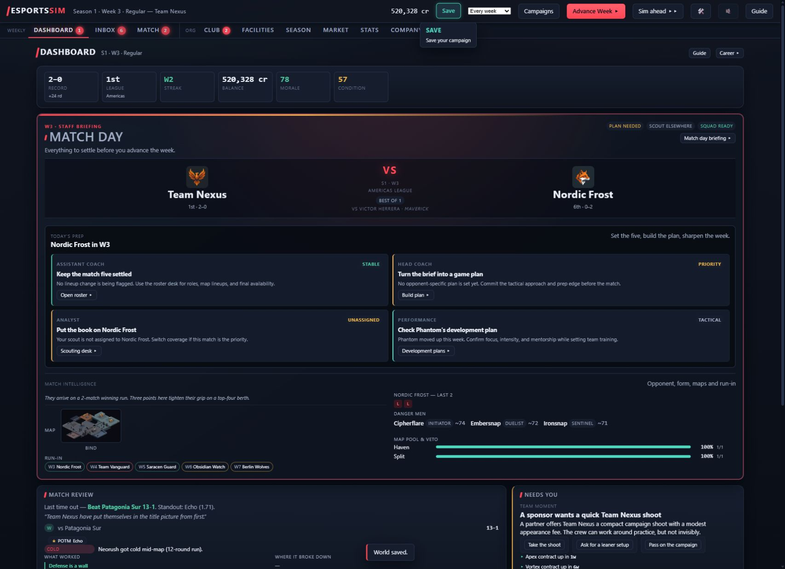
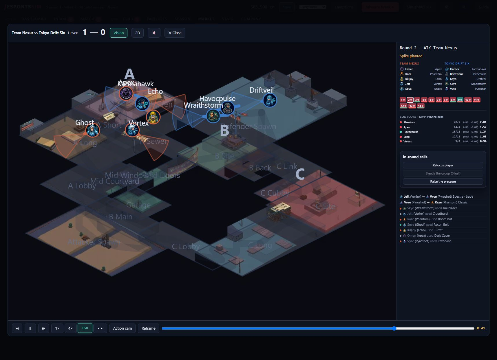

# Preparation, recovery and feedback playtest — 2026-10-06

Question: Can a new manager understand the squad, make sensible preparation
choices, and find their consequences after a fixture?

Played in the local browser UI at `http://127.0.0.1:8421`, fictional-world
sandbox, standard start, Team Nexus, seed **2026**, new world **7NQ6D**.
Season 1 weeks 1–2 resolved; stopped at week 3. Existing world W3STL was left
via the campaign chooser before making gameplay decisions. Social LLM was
disabled on this local server; copy therefore uses the deterministic fallback.
This is a short exploratory session, not a season/balance or causal evaluation.

Build: `805712bcbf35196ca2c1107eb90dc475daa17c8e`, project version `0.0.1`.
Checkout was already dirty (including `scripts/ui_review.py` and untracked
work); those files were not changed by this task. The CSV captures HEAD and
dirty status at every attempt. Model family: GPT-6, per the agent identity;
exact runtime model ID and effort setting were not exposed, so those limits
are explicit in the CSV rather than inferred from a configured default.
Timestamps are actual UTC start/finish times. Opening the app and discovering
the resumed world happened before the helper existed and were not backdated
as CSV actions; logging began before returning to Campaigns.

## Observed outcomes

- Beat Tokyo Drift Six **13–1 on Haven**, then Patagonia Sur **13–1 on Split**.
  Record 2–0, holding 1st of 8; balance **487,320 → 503,508 → 520,328**.
- Vortex rest persisted; condition **32 → 42 → 53** while other starters lost
  condition. This supports trying rest for recovery, not a claim about wins.
- Market sweep reached **20%** coverage after week one. Crimsnap, the potential
  reserve awper, was signed by Iron Pact before recruitment. Scouting has an
  opportunity cost in a live market.
- Light anti-exec scrim produced a Haven book artifact: **+0.75 knowledge,
  −1.5 stamina**, displayed as book +0.8 and +0.0 edge, with an explicit
  provisional-read explanation. This report is on Match → Prep.
- Dashboard review distinguished a young struggling Ghost from a benching
  decision and suggested mentorship. Apex was assigned; mentorship persisted.
  Ghost OVR moved 75.5 → 75.6; one week does not isolate mentorship's effect.

## Friction and actionable findings

1. **Missing mentorship analytics.** UI confirmed the action and the saved
   world contains `mentorships: {ghost: apex}`, but no `mentor` action record.
   `web/server.py:5446` validates and saves both pairing and clearing without
   calling `telemetry.record_action`. `mentor` already exists in ACTION_KINDS
   and the headless decision contract. This is a verified coverage defect;
   no gameplay or telemetry implementation was changed in this playtest.
2. **Scrim feedback is separate from the weekly report.** Full report displays
   league results and finances; recovering the knowledge/stamina result
   required reopening Match → Prep. Before booking, the visible controls did
   not show a numeric cost/stamina forecast. A link from the weekly report to
   the completed preparation artifact would make this outcome easier to find.
3. **Conflicting map instructions.** Game plan named Haven, while the lineup
   paragraph said the map would be unknown when played. Update the explanatory
   text to match the information actually supplied in this mode.
4. **Rest feedback retains the exhaustion warning.** Rest selected and its
   toast are clear, but the row still says “too exhausted to train.” A recovery
   explanation would answer why this is still a useful plan.
5. **Away-win news reads ambiguously.** Week-two reveal shows Team Nexus 13–1,
   but news says “1-13 over Patagonia Sur”; the score is home/away order while
   the sentence is winner-oriented. Use a consistent perspective.
6. **Replay readability.** Several player and map labels overlap at spawn in
   the painted Haven replay. Controls, round timeline, kill feed and speed
   changes worked. This is visual friction, not evidence of map/engine failure.

## Quantitative instrumentation audit

Evidence: [indexed saved telemetry](2026-10-06-preparation-gpt6-telemetry.json),
[existing usage report output](2026-10-06-preparation-gpt6-usage.txt), and
[annotated session CSV](actions.csv). Export includes the test save's SHA-256;
the full disposable save copy is under
`runs/playtests/2026-10-06-preparation-gpt6/saves/`.

| CSV step | Expected decision | Saved zero-based index | Coverage |
|---|---|---|---|
| 6 | Vortex rest / set_dev_plan | 0 | Recorded, matching player/focus/intensity |
| 9 | set_game_plan | 1 | Recorded, matching fixture/opponent/no overrides |
| 11 | set_preparation | 2 | Recorded, matching partner/Haven/anti_exec/light |
| 14 | set_scout | 3 | Recorded, target market |
| 15 | advance W1 | 4 | Recorded, season 1 week 1 |
| 21 | mentor Ghost with Apex | absent | Missing despite persisted pairing |
| 23 | advance W2 | 5 | Recorded, season 1 week 2 |

**6/7 gameplay decisions = 85.7% observed coverage**. All six recorded events
have manager `mgr_team_nexus`, team `team_nexus`, source `web`, phase `regular`,
and expected order. There are **two** weekly snapshots for that manager.
The existing report says 6 recorded actions, 3 actions per advanced week and
five used action kinds. It lists `mentor` as never used, incorrectly for this
session. That result demonstrates why “unused” must be checked against capture
coverage before treating it as a product-demand signal.

Across all 25 observations: 6 recorded, 1 missing gameplay decision, and 18
outside the observed decision instrumentation (navigation, boot/creation,
viewing reports/replays, playback speed, and explicit save). This **24%**
all-observation capture rate is not a gameplay correctness measure: those
activities are intentionally broader than the decision log's vocabulary.

The current substrate can quantify successfully recorded decision usage and
weekly organization state. It cannot reconstruct this session's screen funnel,
time spent, abandoned/rejected actions, replay engagement, or subjective
expectations. ActionRecord stores game season/week, not wall-clock timestamps,
build ID, model, effort, session/attempt IDs, or UI path. Preserve campaign
determinism by keeping those fields in a separate usage sidecar. If broader
analytics are added, use stable sidecar session/attempt IDs to join UI events
to accepted decisions, include failures and views, and deduplicate save copies
before aggregating cross-save usage. Do not add wall-clock fields to GameState.

## Validation and retained artifacts

- Logger tests: **3 passed**, covering quoted/newline CSV roundtrips, append
  preservation, duplicate rejection and schema mismatch without data loss.
- Skill frontmatter validator: passed. `git diff --check`: passed.
- Existing telemetry report successfully loaded only this test world's save.
- No sim, campaign, web, data or balance changes; no full gate run, commit,
  deployment or push was performed.
- Read prior flywheel entries before play. Recorded two learnings and one
  pain-point after play using the documented local recorder fallback.

## Attempt evidence

The following entries mirror this session's completed CSV rows for readable
evidence links. The CSV remains the structured longitudinal record.

### Step 1

2026-10-06T18:22:12.923+00:00 to 2026-10-06T18:22:31.117+00:00; campaign chooser.

**Wanted:** Create a separate playtest campaign after landing on an existing saved career

**Action:** Click Campaigns

**Expected:** Campaign chooser offers a way to create a new career

**Actual:** Confirmation preserved world W3STL; chooser displayed New campaign with seed and team options. AX snapshot briefly omitted the modal; DOM and screenshot showed it.

Result: met; analytics: not_instrumented.

### Step 2

2026-10-06T18:22:31.673+00:00 to 2026-10-06T18:22:43.340+00:00; campaign chooser.

**Wanted:** Start a reproducible sandbox with a familiar mid-table team

**Action:** Set Seed to 2026 and choose Team Nexus in Fictional world / Sandbox / Existing rosters / Standard start

**Expected:** A new Team Nexus campaign begins at season 1 week 1 with its own world code

**Actual:** New campaign at S1 W1: 487320 credits, Team Nexus vs Tokyo Drift Six on Haven. First-week handbook opens with five steps and safe defaults.

Result: met; analytics: not_instrumented.

### Step 3

2026-10-06T18:22:43.882+00:00 to 2026-10-06T18:22:50.760+00:00; S1 W1.

**Wanted:** Find urgent work before changing the squad

**Action:** Use handbook Open Inbox

**Expected:** See actionable deadlines and recommended first-week tasks

**Actual:** Actionable Items says nothing needs attention and no pending manager decisions, although Dashboard flagged Apex contract in 3w and a coach scrim proposal. These are advisory rather than urgent inbox decisions.

Result: partial; analytics: not_instrumented.

### Step 4

2026-10-06T18:22:51.287+00:00 to 2026-10-06T18:22:58.579+00:00; S1 W1.

**Wanted:** Understand the starting five and avoid unnecessary roster changes

**Action:** Open Club

**Expected:** Roster shows starters, condition, confidence, and squad controls

**Actual:** Five players with roles, overall, ceiling, form, morale, condition, confidence, salary and expiry. Vortex has condition 32/morale 55; roster advises six players for tournaments. Dashboard squad-ready flag did not flag low condition.

Result: met; analytics: not_instrumented.

### Step 5

2026-10-06T18:22:59.117+00:00 to 2026-10-06T18:23:08.208+00:00; S1 W1.

**Wanted:** Protect the exhausted Vortex while learning training controls

**Action:** Open Development

**Expected:** Find team focus and individual intensity controls, ideally a rest option

**Actual:** Development exposes auto/rest and light/normal/intense per player; Vortex explicitly marked too exhausted to train.

Result: met; analytics: not_instrumented.

### Step 6

2026-10-06T18:23:08.751+00:00 to 2026-10-06T18:23:21.930+00:00; S1 W1.

**Wanted:** Help Vortex recover before adding workload

**Action:** Set Vortex development focus to rest

**Expected:** Rest persists and exhaustion warning is replaced by rest feedback; recovery can be checked next week

**Actual:** Rest selected and toast confirms Vortex: rest focus, normal intensity. Too exhausted to train warning remains, so recovery benefit is not explained here.

Result: partial; analytics: recorded.

### Step 7

2026-10-06T18:23:22.456+00:00 to 2026-10-06T18:23:30.110+00:00; S1 W1.

**Wanted:** Build a simple opponent-specific plan without over-tuning

**Action:** Open Match

**Expected:** Opponent information, tactics and preparation controls available together

**Actual:** Match opens Strategy with five neutral sliders, roster-fit preview and execution edge; tabs offer Game plan and Prep. Clear explanation that 50 is neutral.

Result: met; analytics: not_instrumented.

### Step 8

2026-10-06T18:23:30.638+00:00 to 2026-10-06T18:23:39.338+00:00; S1 W1.

**Wanted:** Translate opponent briefing into a plan

**Action:** Open Game plan

**Expected:** Plan editor offers opponent target and a save/commit action

**Actual:** Plan shows +0.5 prep edge, opponent at 0% scouted, no counter-strat until match data, focus targets, optional dial overrides and talks. Copy says map is unknown despite header naming Haven.

Result: met; analytics: not_instrumented.

### Step 9

2026-10-06T18:23:39.875+00:00 to 2026-10-06T18:23:48.013+00:00; S1 W1.

**Wanted:** Activate the visible prep edge without speculative target or tactics changes

**Action:** Lock in game plan with no target, book dials, no team talk

**Expected:** Plan commits for Tokyo Drift Six and displays confirmation

**Actual:** plan set badge appears; Lock changes to Update game plan and Scrap the plan. Prep remains +0.5.

Result: met; analytics: recorded.

### Step 10

2026-10-06T18:23:48.548+00:00 to 2026-10-06T18:23:58.488+00:00; S1 W1.

**Wanted:** Assess coach-proposed preparation before the fixture

**Action:** Open Prep

**Expected:** Scrim proposal explains costs and tradeoffs and offers acceptance

**Actual:** Coach proposes Anti Exec on Haven vs sparring partner. Light intensity default; no visible credit cost or stamina forecast before booking.

Result: partial; analytics: not_instrumented.

### Step 11

2026-10-06T18:23:59.065+00:00 to 2026-10-06T18:24:07.067+00:00; S1 W1.

**Wanted:** Try a light Anti Exec scrim aligned with the coach recommendation

**Action:** Book session using default Adriatic Sirens/Haven/Anti Exec/Light

**Expected:** Booked session appears with a clear confirmation and any cost

**Actual:** Booked Anti Exec on Haven (Light) plus confirmation toast; coach proposal disappears. Balance unchanged at booking and no cost estimate visible.

Result: met; analytics: recorded.

### Step 12

2026-10-06T18:24:07.626+00:00 to 2026-10-06T18:24:15.106+00:00; S1 W1.

**Wanted:** Find a realistic future sixth player without buying blind

**Action:** Open Market

**Expected:** Market indicates transfer window status and supports scouting a target

**Actual:** Opening window closes after W5; 13653 credits/week free, 18 free agents and 0% market coverage with estimates only. Crimsnap is an affordable estimated ~71 awper at 5300/week.

Result: met; analytics: not_instrumented.

### Step 13

2026-10-06T18:24:15.651+00:00 to 2026-10-06T18:24:24.842+00:00; S1 W1.

**Wanted:** Reveal reliable free-agent information before recruiting a reserve awper

**Action:** Open Scouting

**Expected:** Scout assignment allows market coverage or an individual target

**Actual:** Scouting offers standing pro/amateur lanes, player deep-dives with staged intel, and Sweep the free-agent market quick assignment.

Result: met; analytics: not_instrumented.

### Step 14

2026-10-06T18:24:25.383+00:00 to 2026-10-06T18:24:32.902+00:00; S1 W1.

**Wanted:** Improve estimates for a future affordable sixth player

**Action:** Click Sweep the free-agent market

**Expected:** Scout assigned to free-agent market; coverage improves after week advance

**Actual:** Deep-dive desk now says Sweeping Free-agent market - coverage 0%.

Result: met; analytics: recorded.

### Step 15

2026-10-06T18:24:33.444+00:00 to 2026-10-06T18:25:29.614+00:00; S1 W1.

**Wanted:** Resolve first match and see consequences of rest, plan and scrim

**Action:** Click Advance Week

**Expected:** Week resolves once with match result, preparation report, finances and development feedback

**Actual:** Resolved to S1 W2; Team Nexus won Haven 13-1 vs Tokyo Drift Six, now 1st of 8. Balance 503508 (+16188); market coverage 20%. Reveal offers Continue and Full report. No causal attribution to prep from this single result.

Result: met; analytics: recorded.

### Step 16

2026-10-06T18:25:30.170+00:00 to 2026-10-06T18:25:37.321+00:00; S1 W2 (W1 reveal).

**Wanted:** Understand what happened beyond the score

**Action:** Click Full report

**Expected:** See prep, training, finance and match feedback together

**Actual:** Full report lists all league results and replay links plus income 53088/expenses 36900; no visible training or scrim explanation in report.

Result: partial; analytics: not_instrumented.

### Step 17

2026-10-06T18:25:37.886+00:00 to 2026-10-06T18:25:51.544+00:00; S1 W2 (W1 results).

**Wanted:** Watch how the convincing win unfolded

**Action:** Open the Team Nexus vs Tokyo Drift Six Haven replay

**Expected:** Replay shows match timeline, map and round events

**Actual:** Painted Haven replay opens and auto-plays, round buttons 1-14, player-follow, speed controls and final box score visible. Phantom MVP 20/7, 2.01 rating; map labels and player labels overlap around spawn.

Result: met; analytics: not_instrumented.

### Step 18

2026-10-06T18:25:52.090+00:00 to 2026-10-06T18:26:06.659+00:00; S1 W2 replay.

**Wanted:** Inspect late-match behavior quickly

**Action:** Set replay to 16x speed

**Expected:** Timeline and round score advance rapidly

**Actual:** 16x selected; timeline advanced from 27 to 60 and kill/utility feed appeared. Playback controls work.

Result: met; analytics: not_instrumented.

### Step 19

2026-10-06T18:26:07.211+00:00 to 2026-10-06T18:26:18.923+00:00; S1 W2.

**Wanted:** Find manager-facing lessons from the win

**Action:** Close replay, Continue results, open Dashboard

**Expected:** Dashboard match review identifies strengths, weaknesses and recommended changes

**Actual:** Dashboard gives Phantom 2.01, 2/2 pistols, attack 11/12; recommends development/mentor for Ghost 0.68 rather than benching young player. Plan consumed; new plan needed. News reveals Crimsnap signed by Iron Pact while we scouted.

Result: met; analytics: not_instrumented.

### Step 20

2026-10-06T18:26:19.453+00:00 to 2026-10-06T18:26:26.659+00:00; S1 W2.

**Wanted:** Check Vortex recovery before deciding whether more rest is needed

**Action:** Open roster via Dashboard Open roster

**Expected:** Condition improves from 32 after a rest week and persists as visible feedback

**Actual:** Vortex condition 32 -> 42 and morale 55 -> 60; others lost 14 condition. Rest helps recovery in this observed week but Vortex remains low. Ghost form falls 72 -> 65.

Result: met; analytics: not_instrumented.

### Step 21

2026-10-06T18:26:27.198+00:00 to 2026-10-06T18:26:38.509+00:00; S1 W2.

**Wanted:** Act on development recommendation for young Ghost

**Action:** Open Development and assign Apex as Ghost mentor

**Expected:** Mentor relationship persists and confirmation explains assignment

**Actual:** Mentorship assignment confirmed toast. Apex available at teaching 73; effect on growth requires future weeks.

Result: met; analytics: missing.

### Step 22

2026-10-06T18:26:39.068+00:00 to 2026-10-06T18:26:49.197+00:00; S1 W2.

**Wanted:** Check whether the booked scrim produced useful feedback

**Action:** Open Match then Prep

**Expected:** Completed scrim report describes benefits and tradeoffs

**Actual:** Prep artifact: Haven anti-exec book +0.8; +0.0 edge; Knowledge +0.75; stamina -1.5. Provisional because no Haven opponent sample. Also Phantom development note. Feedback exists on Prep, not full weekly report.

Result: met; analytics: not_instrumented.

### Step 23

2026-10-06T18:26:49.754+00:00 to 2026-10-06T18:27:46.121+00:00; S1 W2.

**Wanted:** See whether safe defaults allow another fixture while recovery and mentorship continue

**Action:** Advance Week without a new game plan or scrim

**Expected:** Second match resolves legally; rest and mentorship persist; lack of plan is advisory

**Actual:** S1 W3 reveal: won Split 13-1 vs Patagonia Sur, holding 1st. No game-plan blocker. This is a different opponent/map and cannot isolate plan effectiveness.

Result: met; analytics: recorded.

### Step 24

2026-10-06T18:27:46.726+00:00 to 2026-10-06T18:28:17.833+00:00; S1 W3.

**Wanted:** Verify persistent development choices and condition after a second week

**Action:** Continue reveal, open Club Development

**Expected:** Vortex rest and Ghost Apex mentor remain selected; inspect development report

**Actual:** Vortex rest persists and condition is 53 (32 -> 42 -> 53). Ghost Apex mentor selected, mentored icon and 0% complete shown; Ghost OVR 75.5 -> 75.6. Cannot attribute growth to mentorship after one week.

Result: met; analytics: not_instrumented.

### Step 25

2026-10-06T18:28:18.376+00:00 to 2026-10-06T18:28:55.213+00:00; S1 W3.

**Wanted:** Preserve the test campaign for later replay and analytics audit

**Action:** Open Dashboard and click Save

**Expected:** World saved confirmation and final record visible

**Actual:** Dashboard button label changed to Dashboard 1, requiring refreshed locator; Save confirms World saved. Final S1 W3 balance 520328, record 2-0. News describes away win as 1-13 over Patagonia Sur despite reveal showing 13-1.

Result: met; analytics: not_instrumented.
