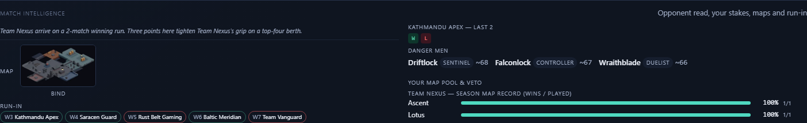
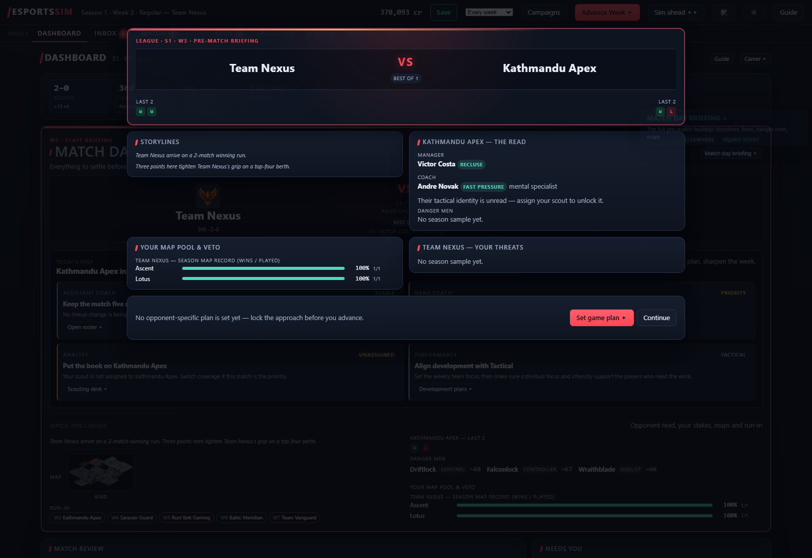

# Match intelligence ownership acceptance

Player question: whose form, stakes and map record am I reading?

Build: base 43b04482f01f441385e8dec02ab78a7d778faf18 plus this PR's dirty presentation patch. Runtime GPT-6.1-sol / medium per delegated task. Reused primary Windows venv with this isolated worktree's src in PYTHONPATH; import path verified. This differs from root's frozen ten-fix build (private reviewed tree d30335a0bb36792d723dc38cb4b788dc8438e851).

Save provenance: copied immutable identified world26UHC seed2038 S1W3 from combined-gap-acceptance/runs/playtests/2026-10-08-ten-gap-validation/saves, including campaign/meta, private sessions companion and match-review corpus. Played only this clone using standalone Chromium on own loopback8463. Root browser and user career untouched. Private auth/save/corpus remain ignored and uncommitted.

Pre-play flywheel discovery found no callable flywheel capability in this runtime. Used repository playtest-log and ship skills, and memory guidance on separate worlds, pre-action logging and separate decision/usage audits. Remote flywheel pre-read/post-record unavailable; learnings are retained below.

## Player evidence

Dashboard names Team Nexus in its two-match winning run and top-four stakes. Kathmandu Apex remains visibly W,L in the named opponent form. Own map bars explicitly label Team Nexus season map record (wins / played), Ascent1/1 and Lotus1/1. The briefing repeats named storylines/map ownership with Kathmandu Apex in a distinct opposition read. Public fixture payload and screenshots are retained here.

Six CSV attempts preserve expectations before action. Step1 Dashboard assertion and step3 briefing assertion failed because CSS renders headings uppercase. Failed checks retained; steps2/4 rechecked Dashboard, step5 completed briefing, step6 closed and saved via UI. Setup initially failed decoding UTF-8 save under Windows cp1252 before any player action; explicit UTF-8 corrected it. No product source changed during corrections. A later report assembly incorrectly assumed PowerShell output UTF-16; UTF-8 corrected that audit without replacing prior evidence.

## Decision audit

Saved normalized campaign JSON is identical before/after navigation and Save. Action_log9->9, telemetry_snaps1->1, S1W3 unchanged. All six CSV rows are outside the deterministic decision vocabulary: zero new decisions expected and zero recorded. Nine inherited decisions (release2, negotiate_open2, negotiate_offer2, advance2, set_dev_plan1) belong to source session and are not coverage here. Isolated telemetry_report loaded exactly one campaign; metadata/sessions were rejected as non-campaign files. The run does not establish preparation causality or balance.

## Separate browser usage audit

Baseline: zero retained sidecar files. End: six26UHC events: session_start, lobby view, dashboard view, lobby visible_time, Save attempt and successful Save result. One paired result, zero unmatched attempts, zero orphan results, zero malformed lines. Sanitized usage-summary omits page-session identifiers/credentials.

Browser request audit confirms /api/matchday and /api/actions/save; zero pageerrors. Matchday opening has no dedicated retained usage event. Failed assertion contexts exited before orderly flush; their usage coverage is unverified. One retained Dashboard view cannot be assigned to every CSV row; visible-time is not attention. Decision and usage evidence are separate.

## Validation and local flywheel findings

Focused: five profile/fixture ownership cases plus three preview/default cases pass; Node syntax passes. Regression distinguishes own WW/Ascent/Lotus wins from opponent WL/Bind1-of-2, varies fixture A/B and acting manager, and proves GameState unchanged. Generic narrative defaults remain pinned. Source frozen before full unfiltered pytest; final result appended after durable runner completes. No engine/balance/pacing/geometry/multi-season tuning changed.

Learning1 (high confidence,26UHC/seed2038): explicit subjects let the player compare own two-win momentum/stakes with opponent mixed form without ambiguous pronouns.

Learning2 (high confidence,26UHC/seed2038): serialized team names plus wins/played legend clarify map ownership on Dashboard and briefing.

Pain point: uppercase headings caused brittle automation assertions; two retained failures illustrate the need to match rendered casing. Original player friction came from mixing own/opponent content without naming ownership.

Full gate: `pytest -q -n2` (unfiltered), **1189 passed in 5746.09s (1:35:46)**, terminal returncode 0. All five frozen source/test SHA256 hashes matched after completion; see full-gate-proof.json. The runner survived the waiting-turn handoff without restart. Own browser server PID40480 and descendants37116/29736 were stopped after acceptance; verification found zero surviving family processes and zero port8463 listeners.
