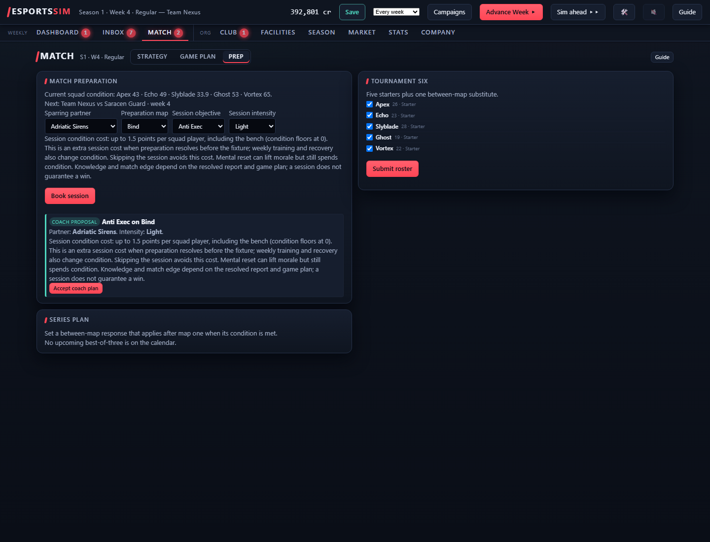
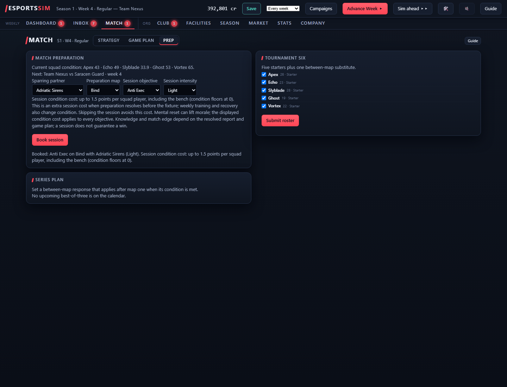

# Preparation decision clarity acceptance

Tested isolated browser server 8465, cloned world **26UHC**, seed **2038**, S1 W4,
Team Nexus. Runtime: **gpt-6.1-sol / medium**. Base commit:
`ac62c26572c67a6a5ee80b45fdacb9664546999c`, with the preparation patch dirty.
Final source hashes are retained in the [audit](2026-10-08-preparation-decision-clarity-audit.json).
The original career, browser servers 8421/8462, and canonical CSV were untouched.

Player question: can I understand what the coach proposes and what preparation
costs a tiring squad before committing?

## Observed behavior

- Before accepting, the coach proposal identifies **Adriatic Sirens / Bind /
  Anti Exec / Light**, with **up to 1.5 condition points per squad player**.
- Manual controls have explicit accessible names: Sparring partner,
  Preparation map, Session objective, and Session intensity. Selecting Normal
  updates only the manual preview to **4**, and Intense updates it to **7.5**.
  The separately booked session continues to show its own cost.
- Current condition is visible: Apex **43**, Echo **49**, Slyblade **33.9**,
  Ghost **53**, Vortex **65**. The UI explains that the whole squad, including
  the bench, pays this extra cost when preparation resolves; weekly training
  and recovery also affect condition; mental reset uses the displayed cost.
- Coach acceptance and manual Light/Normal/Intense bookings all match public
  `/api/club` readback. Condition does not change immediately. Final Light
  booking survives Save and reload. No week was advanced, so this session does
  not establish actual recovery, knowledge gains, match edge, or win effects.
- The first implicit labels included select option text in their accessible
  names. Steps 4–6 were blocked, retained in the CSV, and followed by an
  `aria-labelledby` correction. Exact-name selection succeeded for all four
  controls on the corrected source. These timeouts occurred before snapshot
  capture: their errors survive in the CSV, but their initially assigned step
  text/screenshot paths were not emitted. Browser page errors: **0**.
- Final review found that a level-three strategy lab makes Light cost zero,
  so the initial phrase "mental reset still spends condition" was too broad.
  Step 27 verifies the corrected live copy: "Mental reset can lift morale;
  the displayed condition cost applies to every objective." The zero-cost
  calculation is covered by the alternate-human regression.
- Existing friction remains: booking refreshes the manual form to defaults.
  Step 18 expected an Alpine Echo partner but booked the visible reset default
  Adriatic Sirens. Its assertion passed and initially recorded `met`; step 19
  is the appended correction. Treat step 18 as **partial**, preserving history.

## Decision coverage

The [27-row session CSV](2026-10-08-preparation-decision-clarity-actions.csv)
preserves expectations written before each action. Effective outcomes after the
explicit correction: **23 met, 1 partial, 3 blocked**. This is a separate
concurrent-session CSV for sequential incorporation into the canonical history.

The saved deterministic ledger preserves its entire **15-entry baseline** and
adds **4 decisions**, all matched by team, source, S1 W4, fixture, parameters,
and order. Coverage of accepted preparation decisions: **4/4 (100%)**.

| CSV step | Saved index | Confirmed booking |
| --- | --- | --- |
| 7 | 15 | Coach: Adriatic Sirens / Bind / anti_exec / light |
| 16 | 16 | Manual: Alpine Echo / Bind / mental_reset / intense |
| 18 | 17 | Manual: Adriatic Sirens / Bind / anti_exec / normal |
| 20 | 18 | Manual: Adriatic Sirens / Bind / anti_exec / light |

Each entry has `kind=set_preparation`, `team_id=team_nexus`, `source=web`, and
fixture `s1w4m2am`. Navigation, local selection, inspection, and saving are
outside the decision vocabulary. The three blocked label attempts are
`unverified`, not inferred HTTP failures. Weekly telemetry snapshots remain
**3 before / 3 after**, with byte-equivalent snapshot data, consistent with no
weekly tick. The initial local audit counted the one manager bucket rather than
its three snapshots; this report and the final audit correct that count.

## Separate browser usage coverage

The usage directory began empty in the isolated run. Its retained sidecar has
**61 events**, all for world 26UHC, over **3 page sessions**: **12 view events**,
**34 visible-time slices**, **5 mutation attempts**, and **5 results**.
There are **4 successful preparation pairs** and **1 successful save pair**,
with **0 unmatched attempts, 0 orphan results, and 0 malformed lines**.
The sanitized audit assigns page ordinals because request IDs repeat after
reload. Coarse page views and visible time do not capture individual local
select intentions or prove attention. The blocked selector attempts emitted no
preparation request. Navigation and local selection remain instrumentation
gaps, separate from complete accepted-decision coverage.
The final short copy-readback visit (steps 25–27) added no retained usage
events. Its actual DOM text/screenshots exist, but its browser-usage capture is
unverified; the three retained page sessions are not a complete visit count.

Local raw evidence remains under
`runs/playtests/2026-10-08-preparation-decision-clarity/`: step text, screenshots,
public club readbacks, isolated save, usage report, and decision report. Opaque
browser/session identifiers and campaign files are not staged.

## Verification

Focused preparation tests: **12 passed**. They cover all intensity charges,
strategy-lab discounts, condition-floor clamping, whole-squad participants,
proposal/current-booking parity, repeated read-only serialization, alternate
human perspective, and existing deterministic preparation behavior.
A separate observation-contract counterfactual (seed 707, booked and unbooked)
reconstructs the legacy preparation view and confirms identical legal masks,
byte-identical 406-value encoded vectors, identical resulting GameState JSON,
and identical heuristic choices for six profiles per case. The extra public
preview metadata does not change checkpoint encoding or manager choices in
these controlled checks. Receipts are included in the sanitized audit.
JavaScript syntax and diff checks passed. Full unfiltered `pytest -q -n2`
on the frozen final source passed: **1198 passed in 6235.43s (1:43:55)**,
exit code 0. All four source/test SHA256 hashes still match the audit manifest
after completion. The run log is retained locally at
`runs/preparation-full-pytest-final-n2.log`.
Earlier partial runs were interrupted and superseded: first to correct exact
accessible names, next to correct zero-cost copy, and an initialization-only
run to apply the parent-requested two-worker limit. Only the final run counts
as the complete gate.

No tuning, RNG draw, persisted schema, legal action, match engine, map/data,
development, economy behavior, or competitive balance changed. Balance,
pacing, floor, and snowball gates are outside this patch's trigger set. The
condition-charge expression was extracted without changing its operands,
clamping, ordering, or rounding.

## Flywheel

Inherited recent esports-playtest findings before browser play using the
repository-authorized local recorder fallback. Post-play entries retain two
learnings and one pain point with this world/seed/build evidence:
`esports-playtest-0074`, `esports-playtest-0075`, `esports-playtest-0076`.

1. A proposed preparation plan needs its named partner and intensity beside
   current condition and the extra session cost; booking itself does not
   deduct condition. Confidence: high for this observed surface.
2. Explicit label references make select controls discoverable by exact
   accessible names; visible captions alone did not guarantee that contract.
   Confidence: high for the observed before/after selector behavior.
3. Booking resets the manual form to defaults, so a follow-up booking can use
   a different partner/objective unless the player rechecks it. Confidence:
   medium, observed once and retained as a partial attempt rather than erased.
