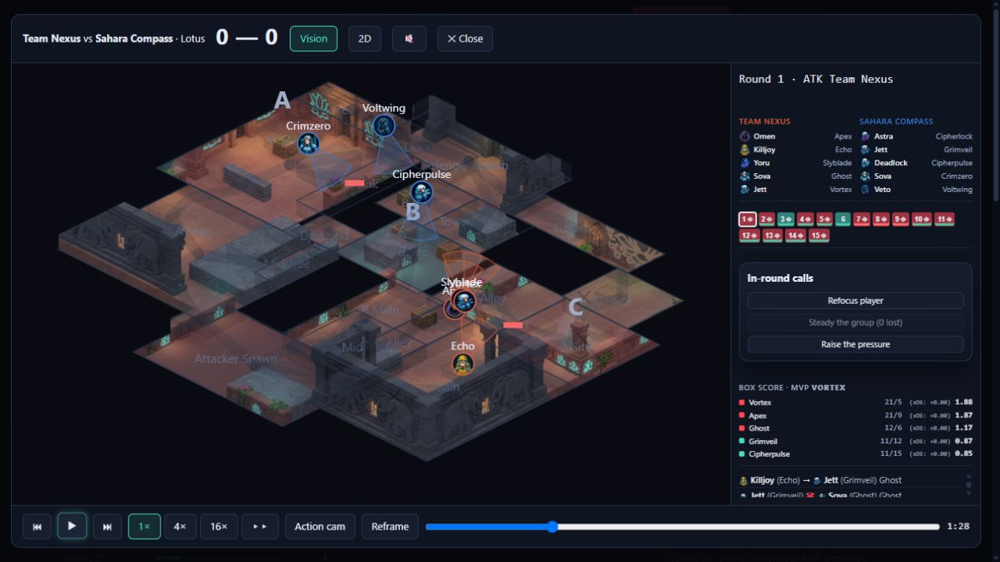

# Historical replay identity acceptance

Player question: after the weekly AI releases a match participant and signs a
replacement, does replay still show the player, team and agent that played?

Tested `3ac34df3a476543d9e79dc4dc03bb381c04e397d` with the replay serializer
patch present (dirty tree), Python package imported from this worktree. Runtime
model `gpt-6.1-sol`, effort `medium`. Browser surface: separate background
Codex browser tab, isolated patched server at `127.0.0.1:8452`; fresh fictional
Sandbox world `WJBF7`, seed 2038. The original played world and server at port
8438 were not changed. Old ignored saves in this worktree were preserved.

Four timestamped attempts were logged before acting, then completed after
visible readback in [the session CSV](evidence/2026-10-08-replay-identity-fix/actions.csv).
The shared actions.csv is left to the coordinating agent for sequential append.

## Observed result

Released Phantom, signed Slyblade using the displayed default negotiation
(6,300 cr/week, 62 weeks), and set Vortex's individual focus to rest with normal
intensity. Squad and Development readbacks confirmed those values. Advanced
week 1: Team Nexus beat Sahara Compass 13-2 on Lotus, matching the reported
defect's original score and box score.

The weekly AI released Grimveil (`team_sahara_compass_p1`) and signed Frostecho
(`fa_7`). The saved current Sahara roster contains Frostecho and omits Grimveil.
The patched replay instead correctly shows Grimveil/Jett under Sahara Compass,
omits Frostecho, and shows Grimveil's 11 kills / 12 deaths under the historical
team. The kill feed renders his handle instead of a humanized player ID.

Vortex's rest setting is a training plan: he still played the actual map. The
separate regression covers a true dressed substitution and excludes that
match's rested bench player.

## Evidence and coverage

[Decision audit](evidence/2026-10-08-replay-identity-fix/decision-audit.json)
records all 5/5 accepted manager decisions in order, with their persisted
params: index 0 release Phantom; 1 open Slyblade talks; 2 accepted offer with
salary 6300 and weeks 62; 3 Vortex rest/normal; 4 advance. All belong to
`team_nexus`, source web, season 1/week 1. One post-week telemetry snapshot was
saved. Two CSV rows group those five decisions; creation and explicit Save are
outside the manager decision vocabulary but have paired browser request/result
evidence. All four CSV rows are marked `recorded`, with the precise supporting
stream named in their annotations. Replay viewing is navigation, not a campaign
decision.

[Retained browser usage](evidence/2026-10-08-replay-identity-fix/usage-report.json)
has 7 attempts and 7 paired success results: creation, release, two negotiation
requests, development plan, advance, and Save. There are zero unmatched
attempts, orphan results or malformed lines in this retained stream. It contains
one replay open, pause and close. These are separate usage evidence, not proof
of campaign decisions, complete historical funnels, attention or exact duration.
The isolated sidecar was new at server startup; it contains one page session
and only this world plus its pre-creation lobby events.

[Raw usage records](evidence/2026-10-08-replay-identity-fix/usage-events.json)
and [single-world telemetry report](evidence/2026-10-08-replay-identity-fix/telemetry-report.txt)
are retained. The full public replay response and disposable save live under
`runs/playtests/2026-10-08-replay-identity-fix/` in this worktree.

## Automated regression scope

Full release gate: `python -m pytest -q -n2` passed **1,188 tests** with no
failures or skips in 4,537.95 seconds. No tests were excluded. The gate ran
before committing; [validation evidence](evidence/2026-10-08-replay-identity-fix/validation.json)
records the command, tested base and worktree import path. Conditional balance,
pacing, snowball, floor and JavaScript gates were not triggered by this serializer
and test change.

Seven focused regressions pass. A real simulated map supplies historical
participants/agents and a dressed substitute; after release, transfer or an
agent-lock edit, the endpoint preserves all played identities and box-score
teams without mutating GameState. Additional cases cover missing, partial and
ambiguous placements, explicit communication team evidence, and reversed
attacking/defending sides.

The serializer reads match.start agents and complete opening round.move
placements: the engine places five attackers at attacker spawn and five
defenders at defensive tactical slots. Explicit round.comms team evidence
takes precedence. Logs lacking authoritative evidence return unknown/null
team or agent identity instead of guessing from today's roster/locks. No engine,
event schema, deterministic save schema, gameplay tuning or JavaScript changed.

## Flywheel findings and gaps

The flywheel MCP was unavailable in this agent's exposed tools, so pre-read did
not run. After play the coordinator identified Agora's direct recorder fallback;
two learnings and one pain point were recorded with medium confidence as
`esports-playtest-0035`, `-0036`, and `-0037`. Their complete records are retained
in [flywheel evidence](evidence/2026-10-08-replay-identity-fix/flywheel.json).
Findings are retained here:

- Learning: a replay must read participants and agents from the played map,
  because weekly AI roster moves can happen immediately after the fixture.
- Learning: complete opening placements plus round-side and explicit team
  events preserve historical team identity without altering engine logs.
- Learning: Vortex's individual rest focus paused practice while preserving
  match participation and experience; training rest does not bench a starter.
- Pain point: the old viewer paired current roster entries with historical
  events, replacing a released participant with a player who never played and
  dropping the actual participant's team from the box score.

This short session establishes replay identity behavior, not balance or the
causal effect of signing/rest on the match result. Browser acceptance did not
exercise transfers or changed agent locks; those have focused regressions.
